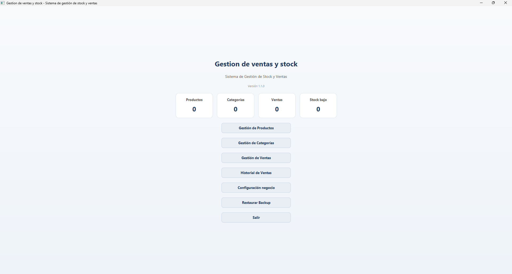
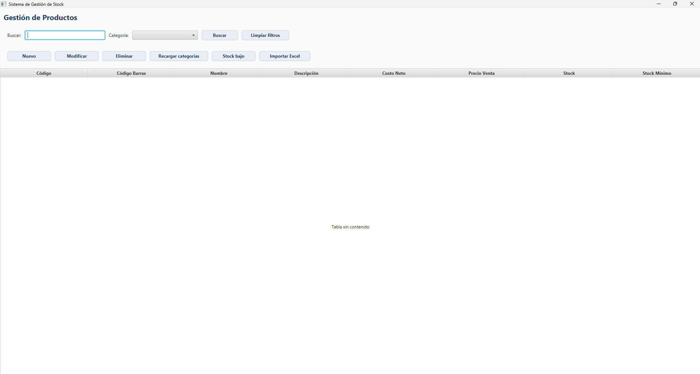
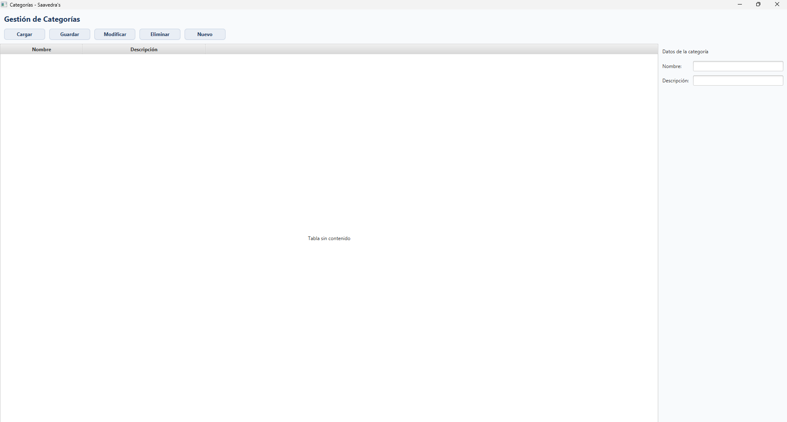
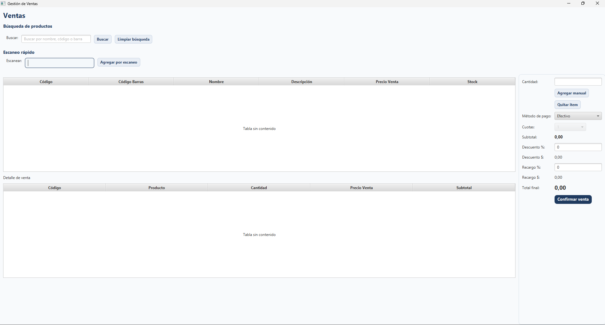
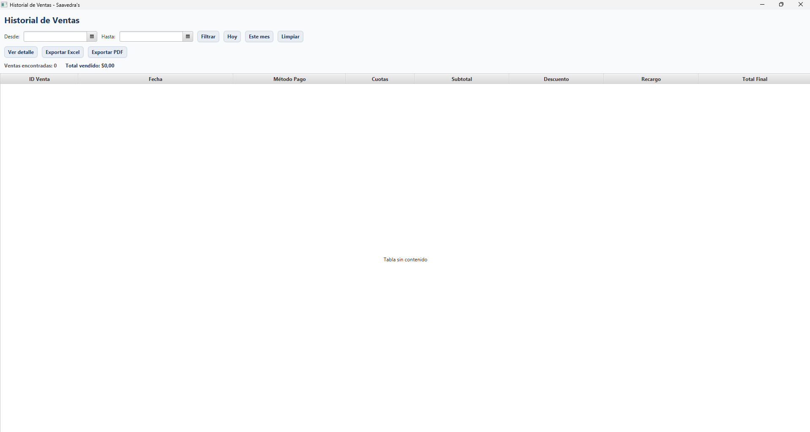

# Sistema de Gestión de Stock y Ventas

Aplicación desarrollada en Java para la gestión de productos, ventas y control de stock utilizando SQLite como base de datos.

## Tecnologías utilizadas

- Java
- SQLite
- Maven
- Arquitectura por capas (DAO, Model, App)

## Funcionalidades

- Alta, baja y modificación de productos
- Gestión de categorías
- Registro de ventas
- Control de stock
- Historial de ventas

## Descripción

Este proyecto fue desarrollado como parte de mi aprendizaje en programación y desarrollo de software. El objetivo fue construir un sistema completo de gestión para pequeños comercios.

## Arquitectura del proyecto

El proyecto está organizado en capas para separar responsabilidades y facilitar el mantenimiento del sistema:

- **model** → contiene las entidades principales del sistema, como productos, categorías y ventas.
- **dao** → contiene la lógica de acceso a datos y la comunicación con la base SQLite.
- **app** → contiene la interfaz gráfica y la lógica principal de la aplicación.

Esta estructura permite mantener el código más ordenado, reutilizable y escalable.

## Cómo ejecutar el proyecto

1. Clonar el repositorio
2. Abrir el proyecto en NetBeans o IntelliJ
3. Ejecutar la aplicación

La base de datos SQLite se inicializa automáticamente usando el archivo `sqlite_init.sql`.

## Capturas del sistema

### Pantalla principal

### Gestión de productos

### Gestión de categorias

### Registro de ventas

### Historial de ventas

## Autor

Felipe Saavedra
